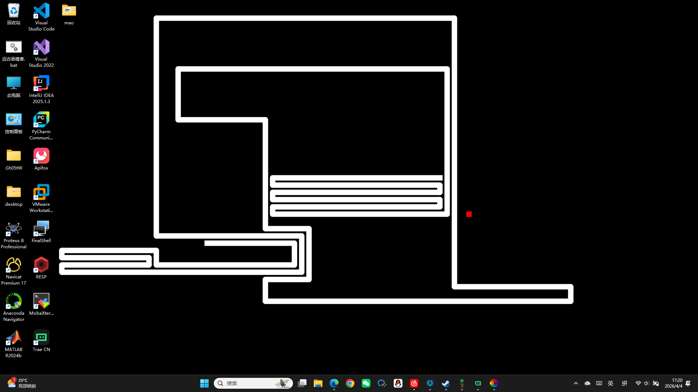

🇨🇳 中文文档 | [English](README.md)
# 贪吃蛇动态壁纸

一个贪吃蛇游戏动画,作为 Windows 桌面壁纸。


## 安装

1. 从 Microsoft Store 安装 [Lively Wallpaper](https://www.microsoft.com/store/productId/9NTM2QC6QWS7)
2. 将 `lively/index.html` 拖入 Lively Wallpaper 窗口
3. 完成

## 自定义

编辑 `lively/index.html`：

```javascript
const CELL_SIZE = 15;      // 方块大小 (像素)
const GAP_SIZE = 5;        // 网格间隔 (像素)
const INITIAL_LENGTH = 5;  // 蛇的初始长度
const GROW_AMOUNT = 15;    // 吃食物后增长量
const FRAME_DELAY = 30;    // 速度 (毫秒，越小越快)
```

## 文件结构

```
dynamic-wallpaper/
├── lively/
│   ├── index.html         # 壁纸文件
│   └── LivelyInfo.json    # 配置文件
└── README.md
```

## 许可证

MIT
